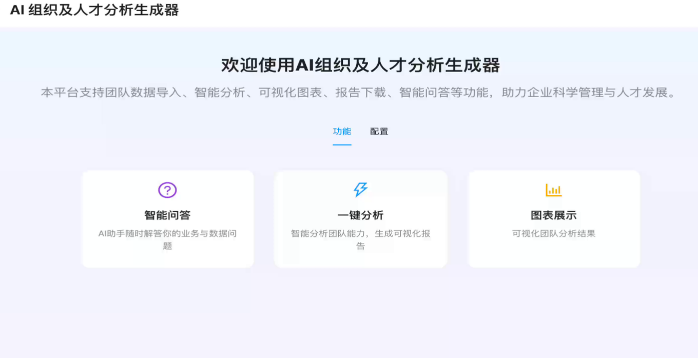
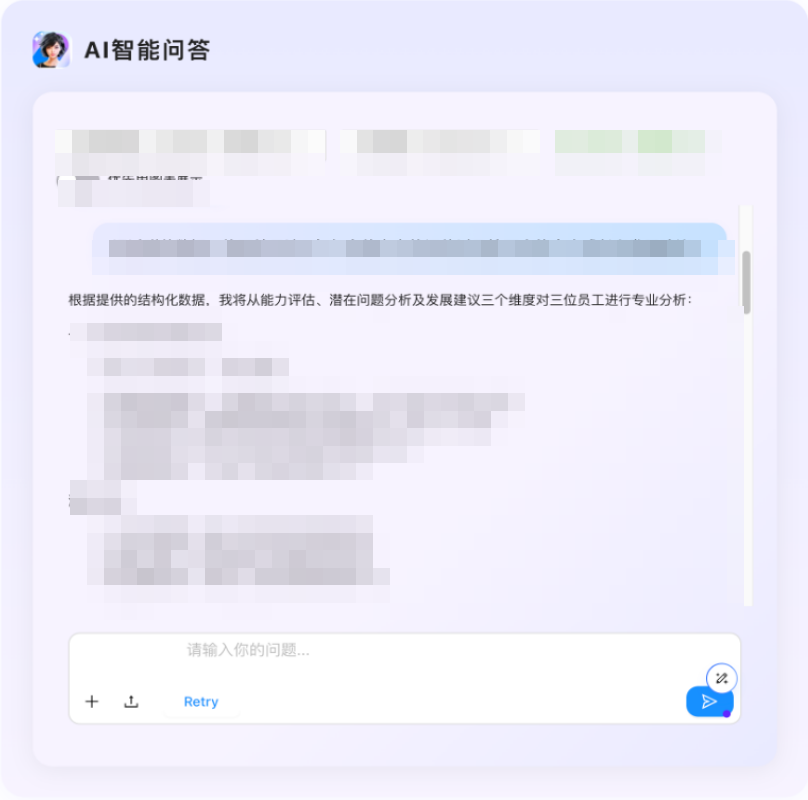
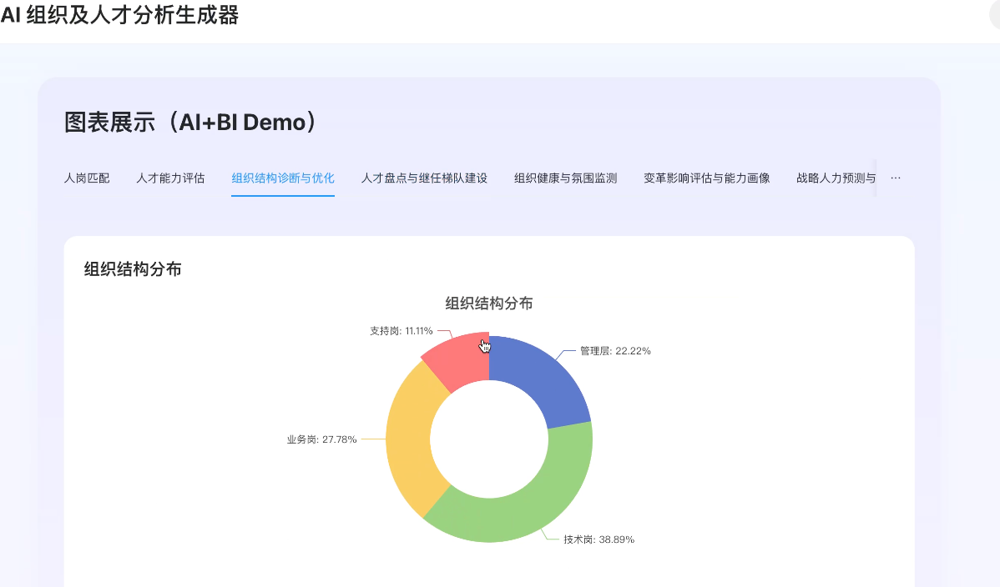

# AI Org & Talent Analytics Demo

An HR AI prototype for exploring how organization and talent data can be turned into analysis, charts, and conversational insights.

This repository is a sanitized public copy of a local demo project. It keeps the parts that show product thinking and implementation work, while excluding local runtime files, uploaded data, model-call logs, payload captures, and private LLM credentials.

Read the case study: [docs/case-study.md](./docs/case-study.md)

## What This Demonstrates

- Upload-driven HR and organization data analysis
- Smart QA over imported datasets
- Chart generation for analysis outputs
- Industry and capability model configuration
- Prompt template configuration
- Pluggable LLM provider configuration pattern
- FastAPI backend with a React frontend

## Screenshots

The screenshots below use sanitized demo views. Source selections, model names, file names, and person-level analysis details are masked where needed.







## Project Structure

```text
.
├── ai_org_talent/
│   └── ai_org_talent_gen/
│       ├── app.py
│       ├── analyze_api.py
│       ├── analyze_utils.py
│       ├── capability_model.py
│       ├── data_utils.py
│       ├── llm_config.py
│       ├── prompt_templates.json
│       └── industry_templates.json
├── frontend/
│   ├── public/
│   ├── src/
│   └── package.json
├── docs/
│   ├── case-study.md
│   └── publish-scope.md
├── examples/
│   └── sample_org_talent_data.csv
├── llm_configs.example.json
└── requirements.txt
```

## Quick Start

Start the backend:

```bash
pip install -r requirements.txt
cd ai_org_talent
python3 -m uvicorn ai_org_talent_gen.app:app --host 0.0.0.0 --port 8003 --reload
```

Start the frontend in a second terminal:

```bash
cd frontend
npm install
npm start
```

Open:

- Frontend: http://localhost:3000
- Backend API: http://localhost:8003

## LLM Configuration

Copy the example config before running model-backed features:

```bash
cp llm_configs.example.json ai_org_talent/ai_org_talent_gen/llm_configs.json
```

Then edit `ai_org_talent/ai_org_talent_gen/llm_configs.json` locally. Do not commit real API keys.

## Public Copy Notes

This public copy intentionally excludes:

- `.git/`, `.cursor/`, `.vscode/`
- `node_modules/`, build caches, Python caches
- `uploads/`, `payloads/`, logs, debug files
- real LLM configuration files and API keys
- private spreadsheets or real organization data

See `docs/publish-scope.md` for the publication scope and rationale.
